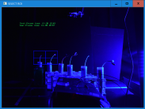

# image tracking and some supporting scripts

cropping for folder, convert imgs to video, tracker2.1
------------
you need `opencv contrib` for python in order for any of this to work.
This was written to be used with an open terminal/from within spyder
(while seeing the printed msgs from the script)

------------

## Table of Contents:
- [cropping for entire folder](#how-to-use-croppingpy)
- [from image folder to video file](#how-to-use-im2vid_v2py)
- [How to use Tracker](#how-to-use-tracker_21py)

##  cropping.py allows you to crop all images in a certain folder and save the resulting imgs to a new folder
#### How to use cropping.py:
1. choose the folder containing the images you want to crop.
2. choose the folder you want the images to be saved to.
	 - there should be a simple file choosing dialog pop up.
	 - otherwise you can just change the variables `in_path` and `out_path` in the `main()` function.
3. the **last** image of the folder should then be shown - choose the area you want to crop.

4. you can use `q` or `ESC` on keyboard to stop.
5. wait untill... TADA!

#### How to use im2vid_v2.py:
1.
2.
3.

#### How to use Tracker_21.py:
1.
2.
3.

------------

##### whats new:
* tracker can be paused with 'p' for manual tracking *(of one point only!)* .
* several types of tracker can be used at the same time.
* several initial rois can be selected at begining of tracking
* added timestamp to img cropping
* added simple file choosing dialog to cropping - needs fine tuning

------------
**2DO:**
- [X] ~~add tracking for second point in order to track angle between 2 points~~
- [ ] manual still needs all sorts of work...
    - [X] ~~can't go to manual when tracking multiple points~~
	- [ ] show previous dots while in manual
- [ ] add run from terminal
	- [ ] finish more robust file dialog for cropping.py
	- [ ] add file dialog for tracker_21.py
	- [ ] add file dialog for im2vid_v2.py
- [ ] file name indepence (trial with imgs from PI/webcam/other name format)
	- [ ] figure out filename independent way to find timestamp
	- [ ] change file oparations to using regex (!)

**2DO - not really important:**
- [X] ~~add timestamp to crop last img~~
- [X] ~~in tracker change color of second tracked point in output video~~
- [X] ~~add time delta to img_procesing~~
- [ ] add brightness controll to img_procesing.py - maybe auto brightness correction for imgs with natural lighting
- [ ] clean up progress bar mess
- [ ] add help section for img_procesing
- [ ] cropping several parts in cropping.py
    - [X] cropping several parts
    - [ ] uneficient! should only open every img once - currently opens as many times as there are ROIs

_**2DO someday (maybe...):**_
- [ ] add GUI (browser based app?)
- [ ] linux / Raspberry PI compatible?

------------
# suggestions are more then welcome!

wishlist:
- [ ] add line option between tracked dots
- [ ] -
- [ ] -
- [ ] -

# posible problems i can think of:
the images in your folder should be named acording to order and all have the same name format:

like this:
- img_001
- img_002
- img_003
...
- img_051
- img_052
...
- img_999
not like this:
- img_1
- img_2
...
- img_12
- img_13

!<del this>[keep for refrence](examples/tip%20with%20track.png <and this>)
